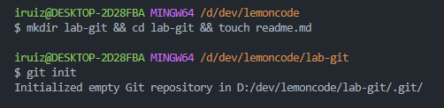
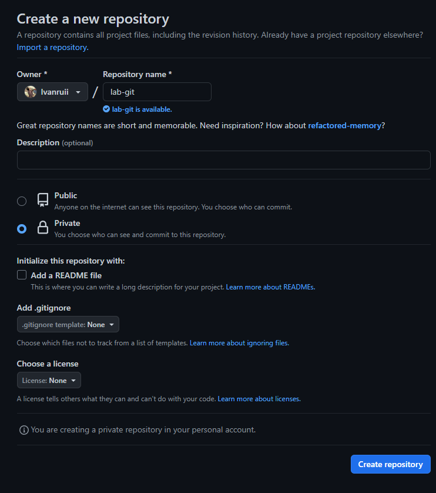
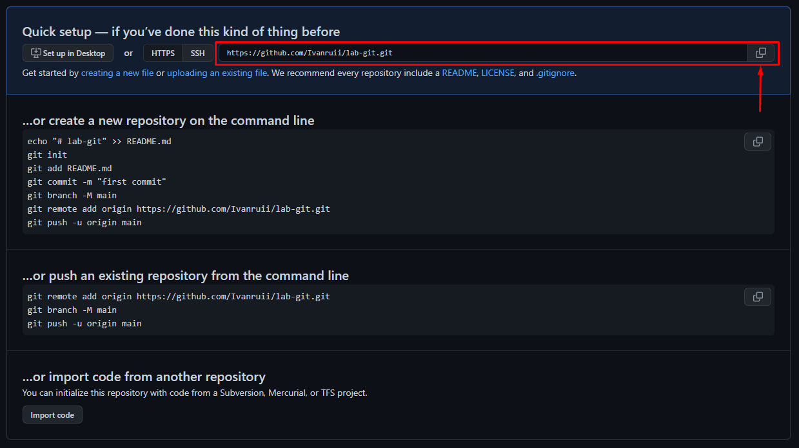
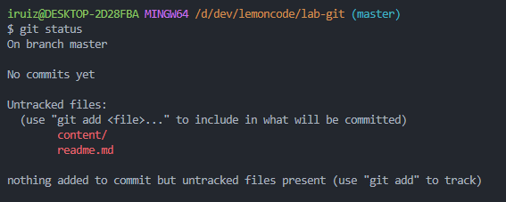

# Laboratorio de Git

1. Crear un repositorio en local.

    

2. Subir el repositorio a GitHub
    - Crea un nuevo repositorio en GitHub.

    

    - Copia el URL del repositorio que acabas de crear en GitHub

    

    - Conecta tu repositorio local con el repositorio en GitHub.

    

    - Verifica que la conexión se haya establecido correctamente.

    