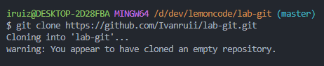

# Laboratorio de Git

---

1. Crear un repositorio en local.

    

2. Subir el repositorio a GitHub
    - Crea un nuevo repositorio en GitHub.

        

    - Copia el URL del repositorio que acabas de crear en GitHub

        

    - Conecta tu repositorio local con el repositorio en GitHub.

        

    - Verifica que la conexión se haya establecido correctamente.

        

3. Hacer un commit y un push.

    

4. Crear una rama
    - Crea una rama nueva llamada "development".
    - Cambia a la nueva rama.

        

    - Realiza algunos cambios en el archivo que creaste.

        

    - Añade y haz un commit con los cambios en la rama "development".

        

    - Sube los cambios a Github.

        

5. Hacer un merge

    - Vuelve a la rama "main".
    - Haz un merge de la rama "development" a la rama "main".

        

    - Si no hay conflictos, los cambios realizados en la rama "development" se incorporarán a la rama "main".
    - Haz un push de los cambios al repositorio en GitHub.

        